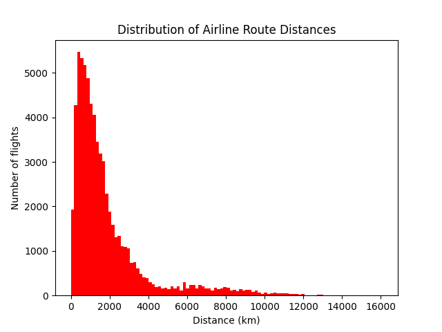

# Airport Data Analysis

This project analyzes global airport and flight route data from 
[OpenFlights](https://openflights.org/data.html) using Python.

## What this project does
- Filters airports by country
- Builds coordinate dictionaries from airport data
- Calculates great-circle distances for all flight routes
- Plots a histogram of flight distance distribution

## Data Sources
- [airports.dat](https://openflights.org/data.html)
- [routes.dat](https://openflights.org/data.html)

## Output

